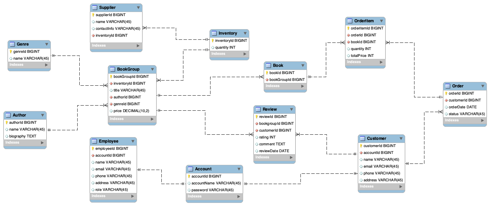

# P2. Database Design and Initial ERD
## Business Problems Addressed
The database aims to solve the following business problems:
- **Inefficient Inventory Tracking:** Organizations struggle to maintain accurate records of books in stock, leading to overstocking, stockouts, and operational inefficiencies.
- **Poor Order Management:** Manual order tracking can lead to delays, errors, and poor customer satisfaction.
- **Lack of Customer Insights:** Without proper customer management, businesses cannot effectively track customer preferences or manage book holdings.
- **Limited Reporting Capabilities:** Businesses need real-time insights into sales, inventory, and revenue trends to make informed decisions.
- **Security Concerns:** Unauthorized access to sensitive data can lead to data breaches and misuse.
- **Scalability Issues:** As the business grows, the system must handle increasing inventory and user loads without performance degradation.
## Entities
- `Book`: Stores individual copies of a book.
  - Primary Key: `bookId`
  - Relationship: One-to-many with `OrderItem`, and many-to-one with `BookGroup`
- `BookGroup`: Stores metadata common to all copies of that book.
  - Primary Key: `bookGroupId`
  - Relationship: One-to-many with `Review` and `Book`, and many-to-one with `Genre`, `Inventory` and `Author`
- `Author`: Stores information about authors of the books.
  - Primary Key: `authorId`
  - Relationship: One-to-many with `BookGroup`
- `Genre`: Categorizes books into genres (e.g., Fiction, Non-Fiction, Sci-Fi).
  - Primary Key: `genreId`
  - Relationship: One-to-many with `BookGroup`
- `Account`: Represents individuals who interact with the system, including customers, employees, and administrators.
  - Primary Key: `accountId`
  - Relationship: One-to-one with `Employee` and `Customer`
- `Employee`: Stores information about employees who manage the system.
  - Primary Key: `employeeId`
  - Relationship: One-to-one with `Account`
- `Customer`: Stores information about customers who purchase books.
  - Primary Key: `customerId`
  - Relationship: One-to-one with `Account`, and one-to-many with `Order` and `Review`
- `Order`: Tracks customer orders, including order status and date.
  - Primary Key: `orderId`
  - Relationship: One-to-many with `OrderItem`, and many-to-one with `Customer`
- `OrderItem`: Links books to orders and tracks the quantity and price of each book in an order.
  - Primary Key: `orderItemId`
  - Relationship: Many-to-one with `Order` and `Book`
- `Inventory`: Tracks the current stock levels of each book.
  - Primary Key: `inventoryId`
  - Relationship: One-to-many with `BookGroup` and `Supplier`
- `Supplier`: Stores information about suppliers who provide books to the inventory.
  - Primary Key: `supplierId`
  - Relationship: Many-to-one with `Inventory`
- `Review`: Captures customer feedback on books purchased.
  - Primary Key: `reviewId`
  - Relationship: Many-to-one with `Customer` and `BookGroup`
## ER Diagram

