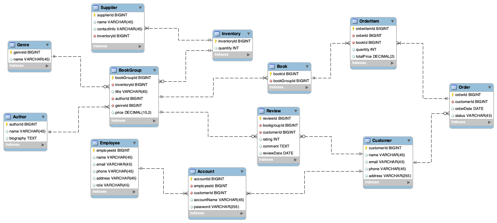

# P3. Final ERD
## Changes made to the initial ERD
Feedback from the TA:
> Your group did really well in P2. And there is nothing wrong in your ERD, so for your P3, please further develop your ERD based on your business requirements, think more about real life cases. For example, I saw your customer to review relationship is one to mandatory many, means one customer as least have one review, which is fine if you intended to design like this, but in real life, sometimes customer might not leave any reviews, thus, the relationship can be one to optional many. Also, is it possible for a customer to have more than one account? Or maybe one person is both a customer and an employee. You can think based on these and add more features to the database.
>

Based on the above feedback, we have implemented the following changes in the ERD:
1. In `BookGroup`, we changed the relationships from “one to mandatory many” to “one to optional many” for Genre to BookGroup and Inventory to BookGroup. This means that a Genre may have no books, and a Book may have no inventory.
2. In `Review`, we changed the relationships from “one to mandatory many” to “one to optional many” for BookGroup to Review and Customer to Review. This means that a Book may have no reviews, and a Customer may not have left a review.
3. In `Order`, we changed the relationship from “one to mandatory many” to “one to optional many” for Customer to Order. This means that a Customer may not have any orders.
4. In `Account`, we added a personalId column to the table and changed the relationships from “one-to-one” to “one-to-many” for Employee to Account and Customer to Account. This means that one person may be both a customer and an employee, and one person may have multiple accounts.
## Final ER Diagram

